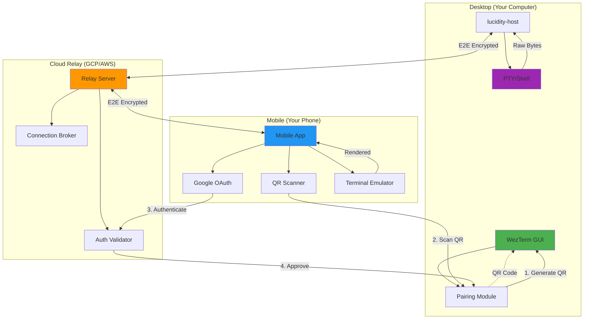

# Lucidity Cloud Relay - Architecture Diagram



## Data Flow

### Pairing (One-time)
1. Desktop generates Ed25519 keypair
2. Desktop shows QR: `lucidity://pair?key=<pubkey>&relay=<id>`
3. Mobile scans QR, extracts desktop public key + relay ID
4. Mobile authenticates with Google OAuth
5. Mobile sends signed pairing request to relay
6. Relay forwards to desktop
7. Desktop approves, stores mobile's public key
8. Mobile saves relay ID + desktop public key

### Runtime (Every connection)
1. Desktop connects to relay with relay ID
2. Mobile connects to relay with relay ID + signature
3. Relay validates signature, brokers connection
4. Desktop ↔ Mobile establish E2E encrypted tunnel (Noise protocol)
5. PTY bytes flow: `PTY → Desktop → Relay → Mobile → Terminal`
6. Input flows: `Mobile Keyboard → Relay → Desktop → PTY`

## E2E Encryption

```
Desktop                 Relay                  Mobile
   |                      |                      |
   |------ Noise XX Handshake (ephemeral keys) --|
   |                      |                      |
   |<----- Encrypted Tunnel (relay is blind) --->|
   |                      |                      |
   | PTY bytes encrypted  |  Forwarded as-is    |
   |--------------------->|--------------------->|
   |                      |                      |
```

Relay sees: encrypted blobs  
Relay cannot: read terminal content, inject commands

## Technology Stack

### Desktop (Rust)
- `lucidity-host` - Existing TCP server
- `lucidity-pairing` - QR generation, device trust
- `lucidity-relay-client` - WebSocket client to relay
- `snow` - Noise protocol implementation
- `qrcode` - QR code generation

### Relay Server (Rust + Tokio)
- `tokio` - Async runtime
- `axum` - WebSocket server
- `tower` - Rate limiting middleware
- `tracing` - Logging/metrics

### Mobile (Swift/Kotlin + Rust Core)
- `lucidity-mobile-core` (Rust) - Protocol, encryption, terminal emulator
- `uniffi` - Rust ↔ Swift/Kotlin FFI
- SwiftUI (iOS) / Jetpack Compose (Android) - UI
- AVFoundation (iOS) / CameraX (Android) - QR scanner

## Deployment Architecture

```
┌─────────────────────────────────────────────┐
│         Cloudflare (DDoS Protection)        │
└─────────────────┬───────────────────────────┘
                  │
┌─────────────────▼───────────────────────────┐
│      GCP Cloud Run (Auto-scaling)           │
│  ┌──────────┐  ┌──────────┐  ┌──────────┐  │
│  │ Relay 1  │  │ Relay 2  │  │ Relay 3  │  │
│  │ us-east  │  │ eu-west  │  │ asia-se  │  │
│  └──────────┘  └──────────┘  └──────────┘  │
└─────────────────────────────────────────────┘
```

- Global load balancing (route to nearest region)
- Auto-scaling based on connection count
- Health checks + auto-restart
- Cloud Logging for debugging
